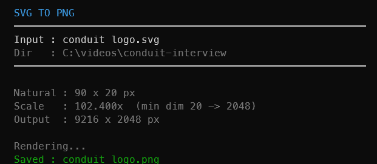

#  svg-to-png

Turn an SVG into a nice big PNG with one right-click

Windows · macOS

<!-- media: hero -->
<!--  -->
<!-- /media: hero -->


## What it is

Sometimes you just need a PNG of an SVG and you want it big enough to actually use. This renders the SVG so its shortest side is at least 2048px, and if it's already bigger than that it keeps its natural size.

The PNG lands right next to the SVG with the same name, so `logo.svg` becomes `logo.png`.

## Get it

Paste this into your AI coding agent (Claude Code, Codex, Cursor...):

> Clone https://github.com/mikecann/svg-to-png and make it my own. It's one of Mike
> Cann's personal tools, so read the README first, change anything specific to his
> setup to suit mine, then help me get it running.

### Or set it up by hand

You'll need Git and [Bun](https://bun.sh). On Windows you can install Bun with
`winget install oven-sh.bun`. The macOS launcher also needs Python 3 to resolve
its symlink back to the clone.

```sh
git clone https://github.com/mikecann/svg-to-png.git
cd svg-to-png
```

On Windows, run this in PowerShell:

```powershell
powershell -NoProfile -ExecutionPolicy Bypass -File .\install.ps1
```

This installs dependencies, writes command stubs into `C:\dev\tools`, and adds
the SVG action to the shared **Mike's Tools** Explorer menu for your user.
Add `C:\dev\tools` to your user PATH if the installer tells you it is missing,
then open a new terminal. You can choose another directory with
`-ToolsDir 'C:\my-tools'`.

On macOS:

```sh
bash install.sh
```

This installs dependencies and links the launcher into `~/.local/bin`. Follow
the printed PATH instruction if that directory isn't already on your PATH.
Use `bash install.sh /path/to/bin` to choose a different directory.

Keep the clone around, the installed commands point at it. Rerun the installer
if you move it. With dependencies already installed, `-SkipDeps` on Windows or
`--skip-deps` on macOS skips that step.

Everything runs locally. There are no API keys or `.env` settings to fill in.

## Using it

From a terminal:

```sh
svg-to-png "path/to/logo.svg"
```

On Windows, right-click any `.svg` file and choose **Mike's Tools > Render to
PNG (2048px min)**. On Windows 11, click **Show more options** first.

The PNG is saved beside the SVG. An existing PNG with that name is replaced;
the original SVG stays as it is. The macOS installer adds the terminal command.

You can also run it directly from the clone without installing the command:

```sh
bun install --frozen-lockfile
bun run svg-to-png.ts "path/to/logo.svg"
```

## Screenshots



## Scaling behaviour

| SVG natural size | Min dim | Scale | Output size |
| ---------------- | ------- | ----- | ----------- |
| 100 x 100        | 100     | 20.48x | 2048 x 2048 |
| 100 x 200        | 100     | 20.48x | 2048 x 4096 |
| 800 x 600        | 600     | 3.41x  | 2731 x 2048 |
| 3000 x 4000      | 3000    | 1x     | 3000 x 4000 |

## Dependencies

| Requirement | Notes |
| ----------- | ----- |
| Bun | Runs the TypeScript CLI |
| `@resvg/resvg-js` | Native SVG renderer, installed by either installer or `bun install` |
| Python 3 | Used by the macOS launcher to resolve its own path |

## Development

```sh
bun install --frozen-lockfile
bun test
bun run build
```

Tests render real SVGs and check the resulting PNG dimensions, error exits,
replacement of existing output, and macOS installation into a directory with
spaces. CI runs on macOS and Windows, including a parse check for every `.ps1`.

If you have PowerShell installed, you can run its checks locally:

```sh
pwsh -NoProfile -File scripts/check-powershell.ps1
pwsh -NoProfile -File scripts/test-install-lib.ps1
```

## Troubleshooting

If `bun` isn't found, install Bun and open a new terminal. If `svg-to-png`
isn't found, check that the install directory is on PATH. If the clone was
moved, rerun the installer.

If rendering fails, check that the input is valid SVG with usable dimensions
or a `viewBox`, and that the directory beside it is writable.

Windows batch stubs use ASCII. Put the clone in a path with ASCII characters;
the installer will stop if the clone path can't be represented safely.

## Uninstalling

On Windows:

```powershell
powershell -NoProfile -ExecutionPolicy Bypass -File .\uninstall.ps1
```

If you used a custom install directory, pass the same `-ToolsDir` value.
This removes this tool's command stubs, icon and Explorer action. The shared
**Mike's Tools** menu and other tools' actions stay in place.

On macOS, remove the symlink, using your custom directory if you chose one:

```sh
rm ~/.local/bin/svg-to-png
```

You can then delete the clone if you no longer want it.

## More tools

You can find my other tools at [mikerosoft.app](https://mikerosoft.app).

MIT licensed.
